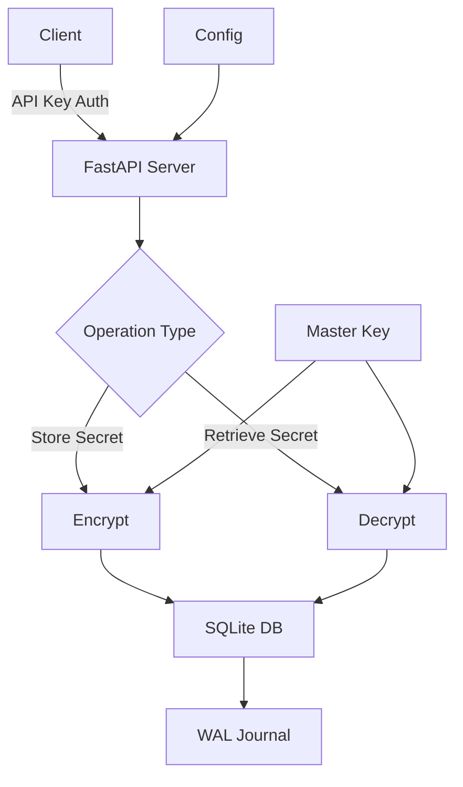

# py_kms

A Python Key Management System (KMS) utilizing FastAPI primarily for air-gapped environments. This lightweight KMS provides secure storage and management of secrets with a focus on SSH keys in isolated networks.

## Features

* Async architecture for efficient concurrent operations
* SQLite-based storage with WAL journaling for better concurrency
* API key authentication and management
* Secure secret encryption using Fernet symmetric encryption
* Support for metadata with secrets
* Simple REST API interface
* Designed for air-gapped environments
* Built-in connection pooling and transaction management
* Support for service-based secret organization

## Installation

1. Clone the repository:
```bash
git clone https://github.com/TeemoTheYiffer/py_kms.git or https://gilab.com/TeemoTheYiffer/py_kms.git
cd py_kms
```

2. Create and activate a virtual environment:
```bash
python -m venv .venv
source .venv/bin/activate  # On Windows use: .venv\Scripts\activate
```

3. Install the package:
```bash
pip install -e .
```

## Configuration

1. The KMS service uses a configuration file located at `~/.py_kms/config.py`. Create the directory if it doesn't exist:
```bash
mkdir ~/.py_kms  # On Windows: mkdir %USERPROFILE%\.py_kms
```

2. Configure the service by setting environment variables or updating the Settings class:

```python
KMS_API_V1_STR="/api/v1"           # API version prefix
KMS_PROJECT_NAME="My KMS"          # Project name
KMS_LOG_LEVEL="INFO"               # Logging level
KMS_APP_DIR="~/.py_kms"           # App directory location
KMS_DB_PATH="~/.py_kms/kms.db"    # Database location
```

## Usage

1. Start the server:
```bash
python -m py_kms.main
```

2. The service will generate a default API key on first startup. Save this key for future use.

3. Use the API endpoints:
```bash
# Store a secret
curl -X POST http://localhost:8000/api/v1/secrets/my-service \
  -H "X-API-Key: your-api-key" \
  -F "secret_data=my-secret" \
  -F 'metadata={"environment": "production"}'

# Retrieve a secret
curl http://localhost:8000/api/v1/secrets/my-service \
  -H "X-API-Key: your-api-key"
```

## Workflow Diagram



## Security Considerations

* The master key is stored in the SQLite database
* All secrets are encrypted using Fernet symmetric encryption
* API keys are required for all operations
* The service is designed for air-gapped environments
* SQLite WAL mode provides better concurrency and data integrity

## Development

Install development dependencies:
```bash
pip install -e ".[dev]"
```

Run tests:
```bash
pytest
```

## Deployment

### Using NGINX

1. Install NGINX:
```bash
# Ubuntu/Debian
sudo apt install nginx

# RHEL/CentOS
sudo yum install nginx
```

2. Create NGINX configuration file `/etc/nginx/sites-available/py_kms`:
```nginx
server {
    listen 80;
    server_name your_domain.com;  # Replace with your domain

    # Redirect HTTP to HTTPS
    return 301 https://$server_name$request_uri;
}

server {
    listen 443 ssl;
    server_name your_domain.com;  # Replace with your domain

    ssl_certificate /path/to/cert.pem;
    ssl_certificate_key /path/to/key.pem;
    ssl_protocols TLSv1.2 TLSv1.3;
    ssl_ciphers HIGH:!aNULL:!MD5;

    location / {
        proxy_pass http://127.0.0.1:8000;
        proxy_http_version 1.1;
        proxy_set_header Upgrade $http_upgrade;
        proxy_set_header Connection "upgrade";
        proxy_set_header Host $host;
        proxy_set_header X-Real-IP $remote_addr;
        proxy_set_header X-Forwarded-For $proxy_add_x_forwarded_for;
        proxy_set_header X-Forwarded-Proto $scheme;
    }
}
```

3. Enable the site:
```bash
sudo ln -s /etc/nginx/sites-available/py_kms /etc/nginx/sites-enabled/
sudo nginx -t
sudo systemctl restart nginx
```

4. Create systemd service file `/etc/systemd/system/py_kms.service`:
```ini
[Unit]
Description=Python KMS Service
After=network.target

[Service]
User=py_kms
Group=py_kms
WorkingDirectory=/opt/py_kms
Environment="PATH=/opt/py_kms/.venv/bin"
ExecStart=/opt/py_kms/.venv/bin/python -m py_kms.main
Restart=always

[Install]
WantedBy=multi-user.target
```

### Using Apache

1. Install Apache and mod_wsgi:
```bash
# Ubuntu/Debian
sudo apt install apache2 libapache2-mod-wsgi-py3

# RHEL/CentOS
sudo yum install httpd python3-mod_wsgi
```

2. Create Apache configuration file `/etc/apache2/sites-available/py_kms.conf`:
```apache
<VirtualHost *:80>
    ServerName your_domain.com
    Redirect permanent / https://your_domain.com/
</VirtualHost>

<VirtualHost *:443>
    ServerName your_domain.com
    
    SSLEngine on
    SSLCertificateFile /path/to/cert.pem
    SSLCertificateKeyFile /path/to/key.pem
    
    ProxyPreserveHost On
    ProxyPass / http://127.0.0.1:8000/
    ProxyPassReverse / http://127.0.0.1:8000/
    
    RequestHeader set X-Forwarded-Proto https
    RequestHeader set X-Forwarded-Ssl on
    
    ErrorLog ${APACHE_LOG_DIR}/py_kms_error.log
    CustomLog ${APACHE_LOG_DIR}/py_kms_access.log combined
</VirtualHost>
```

3. Enable required modules and site:
```bash
sudo a2enmod ssl proxy proxy_http headers
sudo a2ensite py_kms
sudo systemctl restart apache2
```

### Production Best Practices

1. Create dedicated user:
```bash
sudo useradd -r -s /bin/false py_kms
sudo chown -R py_kms:py_kms /opt/py_kms
```

2. Set appropriate file permissions:
```bash
chmod 600 /opt/py_kms/.env
chmod 700 /opt/py_kms/.py_kms
```

3. Set environment variables in `/opt/py_kms/.env`:
```bash
KMS_LOG_LEVEL=WARNING
KMS_APP_DIR=/opt/py_kms/.py_kms
KMS_DB_PATH=/opt/py_kms/.py_kms/kms.db
```

### Monitoring

Consider setting up monitoring using one of these tools:
- Prometheus with FastAPI prometheus middleware
- Grafana for visualization
- ELK stack for log aggregation
- Uptime monitoring with Healthchecks.io